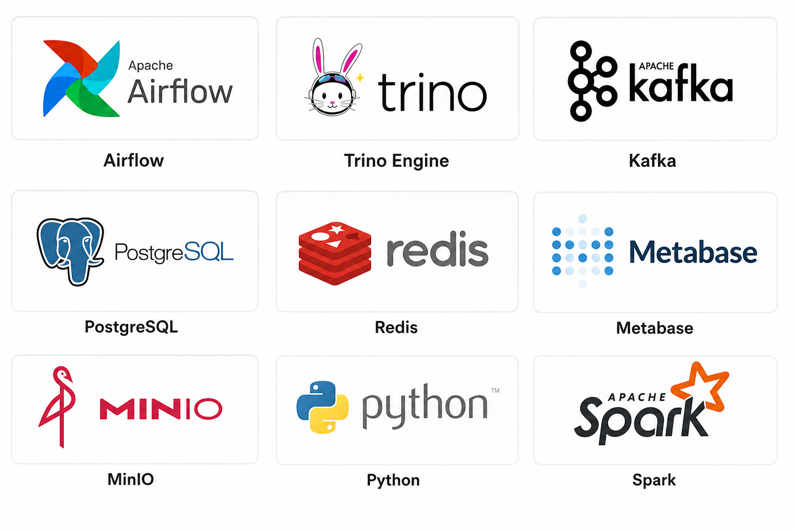
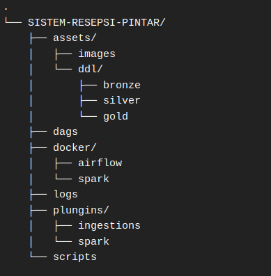
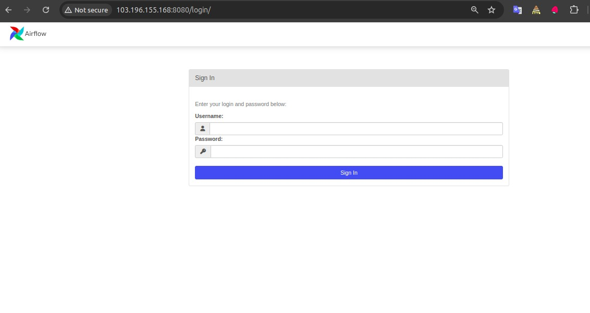
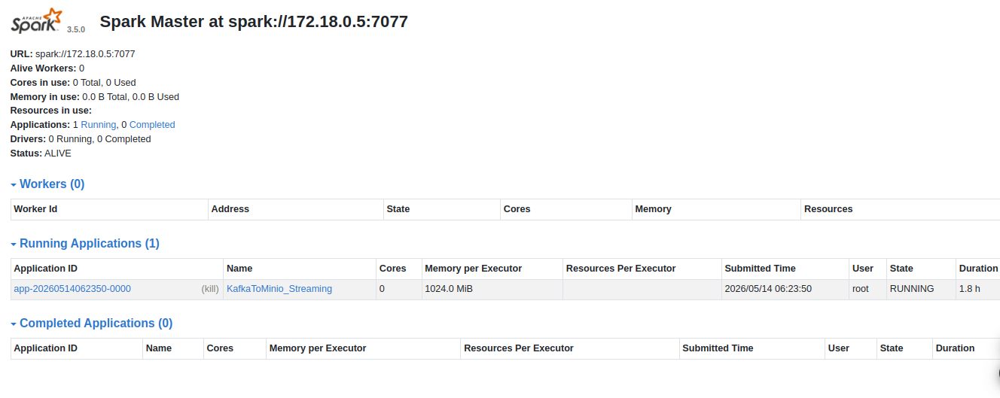
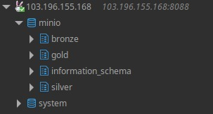
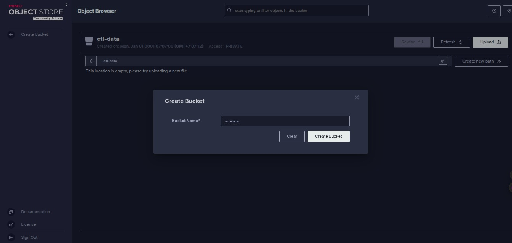
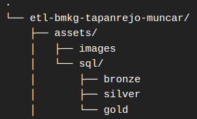
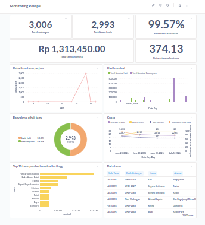

# 🚀 MONITORING TAMU UNDANGAN ACARA RESEPSI

Melakukan pengambilan data api publik dari bmkg dengan library **beautifulsoup4 dan cloudscraper** dan mengambil data tamu undangan via google sheets dengan menerapkan konsep ETL (Extract Transform Load), untuk data source mengambil dari website public (api.bmkg.go.id) dan data google sheets kemudian di ingestion pada data-lake menggunkana **MINIO**. Proyek ini menggunakan konsep **Medallion architecture** dan **Trino Engine** sebagai pengolah data minio yang sudah di transform.

## ✨ Tools yang digunakan

* **Language**: Python
* **Workflow Orchestration**: Apache Airflow
* **Distributed Processing**: PySpark 3.5.0
* **Object Storage**: MinIO
* **Database**: PostgreSQL
* **Data Manipulation**: Spark SQL
* **Environment Management**: Python Dotenv
* **Database Driver**: Psycopg2 Binary
* **Containerization**: Docker & Docker Compose

## 📁 struktur folder


## 🚀 Cara Menjalankan (Quick Start)
Pastikan kamu sudah menginstall **Docker** dan **Docker Compose** di laptopmu.

1. **Clone Repositori**
   ```bash
    https://github.com/AgustiBayuSamudro/sistem-resepsi-pintar.git
2. **Build dan jalankan docker**
   ``` bash
   docker compose up --build -d
3. **kemudian buka browser yang di gunakan dan masuk ke url dengan localhost**
   ``` bash
   http://103.196.155.168 atau http://localhost
* **MINIO**
    ``` bash
    http://103.196.155.168:9001/

* **AIRFLOW**
    ``` bash
    http://103.196.155.168:8080/

* **SPARK**
    ``` bash
    http://103.196.155.168:8081/


4. **Buat scema pada trino engine**
Struktur schema pada engine Trino yang mengelola data di MinIO:


## 🧪 Cara Pengujian (Testing)
1. **Buat buket pada minio**    
    
    ``` bash
    dengan username: minio dan password: minio123    
2. **Jalankan airlow sampai status runing**
    ``` bash
    http://103.196.155.168:8080/
    dengan username: admin dan password: admin
3. **Jalankan query sql yang berada pada**
       
4. **Setup Metabase**    
        